# Thermodynamics System Documentation

## Overview

This documentation set describes a comprehensive, physically accurate thermodynamics engine for simulating liquid solutions. The system calculates instantaneous properties and rate capabilities—it does **not** simulate time evolution.

### Key Principles

- **First Principles**: Every equation derives from fundamental physics with citations
- **TDD Methodology**: All calculations validated against published literature values
- **OCP Architecture**: New substances and models can be added without modifying existing code
- **Static Properties**: Calculates current state and tendencies, not time-stepped dynamics

---

## Document Map

```mermaid
flowchart TD
    subgraph foundations [Part I: Foundations]
        D01[01_Design_Principles]
        D02[02_Substance_Model]
        D03[03_Composition_System]
    end

    subgraph core [Part II: Core Systems]
        D04[04_Volume_System]
        D05[05_Pressure_System]
        D06[06_Gravity_Hydrostatics]
    end

    subgraph thermal [Part III: Thermal]
        D07[07_Heat_Capacity]
        D08[08_Heat_of_Mixing]
        D09[09_Thermal_Conductivity]
    end

    subgraph transport [Part IV: Transport]
        D10[10_Viscosity]
        D11[11_Diffusion]
    end

    subgraph surface [Part V: Surface]
        D12[12_Surface_Tension]
    end

    subgraph phase [Part VI: Phase]
        D13[13_Colligative_Properties]
        D14[14_Gas_Solubility]
    end

    subgraph advanced [Part VII: Advanced]
        D15[15_Osmotic_Pressure]
        D16[16_Dielectric_Constant]
    end

    subgraph integration [Part VIII: Integration]
        D17[17_Container_Model]
        D18[18_Spectral_Integration]
        D19[19_Demo_Specification]
        D20[20_Implementation_Architecture]
    end

    subgraph quality [Part IX: Quality]
        D21[21_Test_Plan]
        D22[22_Data_Sources]
    end

    foundations --> core
    core --> thermal
    thermal --> transport
    transport --> surface
    surface --> phase
    phase --> advanced
    advanced --> integration
    integration --> quality
```

---

## Quick Reference

### Part I: Foundations

| Document | Description | Key Content |
|----------|-------------|-------------|
| [01_Design_Principles](01_Design_Principles.md) | Architectural patterns and methodology | TDD, OCP, First Principles, Type System |
| [02_Substance_Model](02_Substance_Model.md) | Pure substance data model | All property categories, Water/Ethanol data |
| [03_Composition_System](03_Composition_System.md) | Mole-based composition | Mole fractions, Conservation, Operations |

### Part II: Core Systems (Stage 1-2)

| Document | Description | Key Equations |
|----------|-------------|---------------|
| [04_Volume_System](04_Volume_System.md) | Volume with non-ideal mixing | V = V_ideal + V^E, Redlich-Kister |
| [05_Pressure_System](05_Pressure_System.md) | Gas law, vapor pressure, activity | PV=nRT, Antoine, Raoult, Margules |
| [06_Gravity_Hydrostatics](06_Gravity_Hydrostatics.md) | Pressure gradients, buoyancy | dP/dh = ρg, Archimedes |

### Part III: Thermal Systems (Stage 3)

| Document | Description | Key Equations |
|----------|-------------|---------------|
| [07_Heat_Capacity](07_Heat_Capacity.md) | Energy for temperature change | Cp_mix = Σ x_i Cp_i |
| [08_Heat_of_Mixing](08_Heat_of_Mixing.md) | Temperature change on mixing | ΔT = -H^E / Cp |
| [09_Thermal_Conductivity](09_Thermal_Conductivity.md) | Heat transfer rate | q = -k dT/dx, Filippov |

### Part IV: Transport Systems (Stage 4)

| Document | Description | Key Equations |
|----------|-------------|---------------|
| [10_Viscosity](10_Viscosity.md) | Flow resistance | Grunberg-Nissan, Andrade |
| [11_Diffusion](11_Diffusion.md) | Passive mixing rate | D = kT/(6πηr), Fick's Law |

### Part V: Surface Systems (Stage 5)

| Document | Description | Key Equations |
|----------|-------------|---------------|
| [12_Surface_Tension](12_Surface_Tension.md) | Interfacial properties | Macleod-Sugden, Capillary rise |

### Part VI: Phase Systems (Stage 6)

| Document | Description | Key Equations |
|----------|-------------|---------------|
| [13_Colligative_Properties](13_Colligative_Properties.md) | Boiling/freezing shifts | ΔT_b = K_b m, ΔT_f = K_f m |
| [14_Gas_Solubility](14_Gas_Solubility.md) | Dissolved gas | Henry's Law: p = H x |

### Part VII: Advanced Systems (Stage 7)

| Document | Description | Key Equations |
|----------|-------------|---------------|
| [15_Osmotic_Pressure](15_Osmotic_Pressure.md) | Membrane pressure | Π = iMRT |
| [16_Dielectric_Constant](16_Dielectric_Constant.md) | Electrical properties | Kraszewski mixing, Born solvation |

### Part VIII: Integration

| Document | Description | Content |
|----------|-------------|---------|
| [17_Container_Model](17_Container_Model.md) | State aggregation | Container class, Property pipeline |
| [18_Spectral_Integration](18_Spectral_Integration.md) | Rendering bridge | Path length, Beer-Lambert |
| [19_Demo_Specification](19_Demo_Specification.md) | Demo scenarios | Stage-by-stage demos |
| [20_Implementation_Architecture](20_Implementation_Architecture.md) | Code structure | Module layout, OCP patterns |

### Part IX: Quality Assurance

| Document | Description | Content |
|----------|-------------|---------|
| [21_Test_Plan](21_Test_Plan.md) | TDD strategy | Test structure, Validation data |
| [22_Data_Sources](22_Data_Sources.md) | References | Citations, Property data tables |

---

## Implementation Stages

| Stage | Documents | Systems |
|-------|-----------|---------|
| 1 | 01-03, 04 | Substance, Composition, Volume |
| 2 | 05, 06 | Ideal Gas, Vapor Pressure, Activity, Hydrostatic |
| 3 | 07, 08, 09 | Heat Capacity, Heat of Mixing, Thermal Conductivity |
| 4 | 10, 11 | Viscosity, Diffusion |
| 5 | 12 | Surface Tension |
| 6 | 13, 14 | Colligative, Henry's Law |
| 7 | 15, 16 | Osmotic Pressure, Dielectric |
| 8 | 17-20 | Container, Spectral, Demo, Architecture |

---

## Reading Paths

### For Implementers
1. [01_Design_Principles](01_Design_Principles.md) — Understand patterns
2. [20_Implementation_Architecture](20_Implementation_Architecture.md) — Code structure
3. Stage documents in order (04 → 16)
4. [21_Test_Plan](21_Test_Plan.md) — TDD approach

### For Physics Understanding
1. [02_Substance_Model](02_Substance_Model.md) — Property overview
2. Individual system documents for derivations
3. [22_Data_Sources](22_Data_Sources.md) — Reference data

### For Adding New Substances
1. [02_Substance_Model](02_Substance_Model.md) — Required properties
2. [22_Data_Sources](22_Data_Sources.md) — Data sources
3. [20_Implementation_Architecture](20_Implementation_Architecture.md) — Registration pattern

### For Demo Development
1. [19_Demo_Specification](19_Demo_Specification.md) — Demo scenarios
2. [17_Container_Model](17_Container_Model.md) — State access
3. [18_Spectral_Integration](18_Spectral_Integration.md) — Visual rendering

---

## Glossary

| Term | Definition |
|------|------------|
| **Activity (a)** | Effective concentration accounting for non-ideality: a = γx |
| **Activity Coefficient (γ)** | Measure of non-ideal behavior: γ = 1 for ideal |
| **Colligative Property** | Property depending only on number of solute particles |
| **Composition** | Moles of each substance in a system |
| **Excess Property (X^E)** | X_real - X_ideal; deviation from ideal mixing |
| **Henry's Constant (H)** | Gas-liquid equilibrium: p = Hx |
| **Mole Fraction (x)** | n_i / n_total; fraction of total moles |
| **Molality (m)** | mol solute / kg solvent |
| **Molarity (M)** | mol solute / L solution |
| **OCP** | Open-Closed Principle: open for extension, closed for modification |
| **Partial Molar Property** | (∂X/∂n_i) at constant T, P, n_j |
| **Redlich-Kister** | Polynomial model for excess properties |
| **TDD** | Test-Driven Development |
| **Van't Hoff Factor (i)** | Number of particles per formula unit |

---

## Version History

| Version | Date | Changes |
|---------|------|---------|
| 1.0 | 2024-12 | Initial documentation set |

---

## Related Documentation

- [Original System Docs](../00_Index.md) — Earlier design documents
- [Spectral Rendering](../../src/core/materials/Material.ts) — Existing material system
- [Architecture Overview](../../src/docs/ARCHITECTURE.md) — Full system architecture
