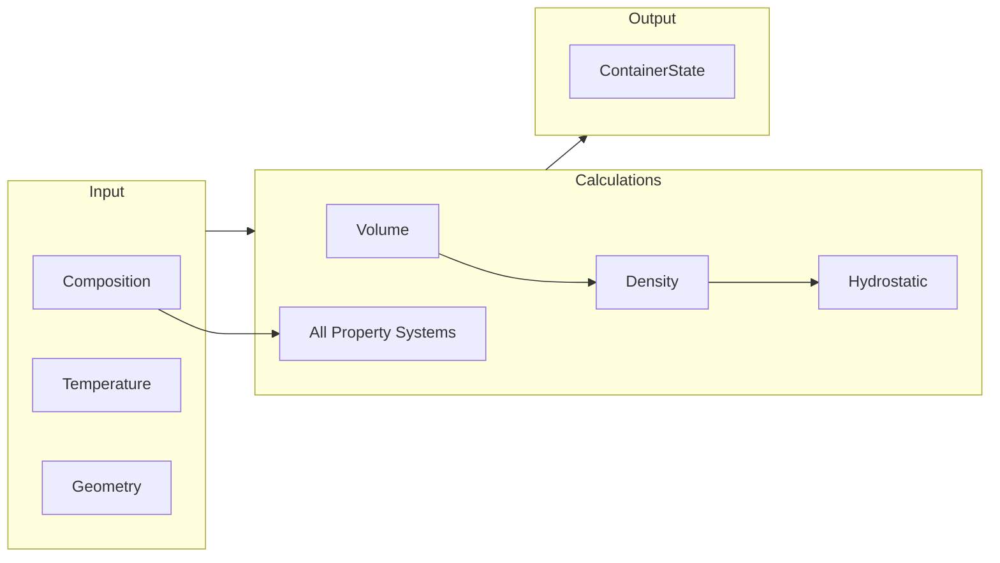
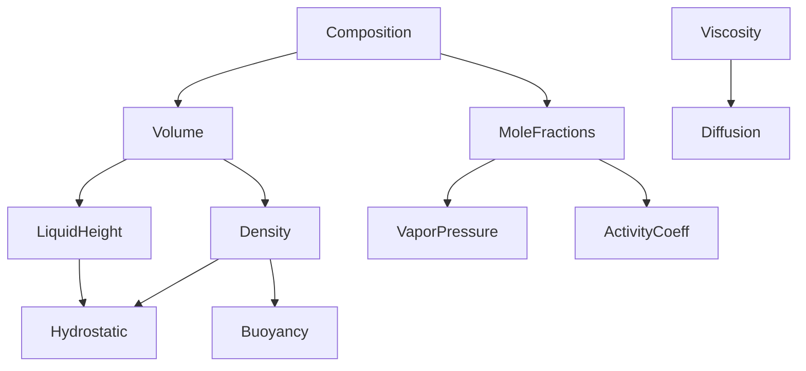

# Container Model

## Overview

This document defines the Container model, which aggregates all thermodynamic properties for a physical container holding a solution. The Container is the interface between the thermodynamics engine and the rest of the game (rendering, interaction, simulation).

---

## 1. Conceptual Model

### 1.1 What Is a Container?

A Container represents a physical vessel holding liquid (and possibly gas):
- **Geometry**: Shape, capacity, height, cross-section
- **State**: Composition, temperature
- **Properties**: All calculated thermodynamic values
- **Connectivity**: How it connects to other containers (future)

### 1.2 Container vs Composition

| Composition | Container |
|-------------|-----------|
| Abstract collection of moles | Physical object |
| No geometry | Has shape and volume |
| No temperature | Has temperature |
| Just moles | Full thermodynamic state |

### 1.3 State Calculation Pipeline



---

## 2. Container Geometry

### 2.1 Data Structure

```typescript
interface ContainerGeometry {
  /** Unique identifier */
  readonly id: string;

  /** Human-readable name */
  readonly name: string;

  /** Maximum capacity in liters */
  readonly capacity: number;

  /** Internal height in meters */
  readonly height: number;

  /** Cross-sectional area in m² (for cylindrical approximation) */
  readonly crossSection: number;

  /** Whether container is open or sealed */
  readonly isOpen: boolean;

  /** Shape for rendering */
  readonly shape: 'cylinder' | 'beaker' | 'flask' | 'tube';
}
```

### 2.2 Standard Containers

```typescript
const STANDARD_CONTAINERS: ContainerGeometry[] = [
  {
    id: 'beaker-100ml',
    name: '100 mL Beaker',
    capacity: 0.1,
    height: 0.07,
    crossSection: 0.00143,  // π × (0.0214)² for 4.28 cm diameter
    isOpen: true,
    shape: 'beaker',
  },
  {
    id: 'flask-250ml',
    name: '250 mL Erlenmeyer Flask',
    capacity: 0.25,
    height: 0.14,
    crossSection: 0.00179,  // Average
    isOpen: true,
    shape: 'flask',
  },
  {
    id: 'test-tube',
    name: 'Test Tube (15 mL)',
    capacity: 0.015,
    height: 0.15,
    crossSection: 0.0001,
    isOpen: true,
    shape: 'tube',
  },
];
```

---

## 3. Container State

### 3.1 Full State Interface

```typescript
interface ContainerState {
  // === Identity ===
  readonly containerId: string;

  // === Input State ===
  readonly composition: Composition;
  readonly temperature: number;  // K
  readonly externalPressure: number;  // kPa (atmospheric for open containers)

  // === Calculated Properties ===

  // Volume (Stage 1)
  readonly volume: VolumeResult;
  readonly liquidHeight: number;  // m
  readonly fillFraction: number;  // 0-1

  // Density
  readonly density: number;  // kg/m³
  readonly averageMolarMass: number;  // g/mol

  // Pressure (Stage 2)
  readonly surfacePressure: number;  // kPa
  readonly bottomPressure: number;   // kPa
  readonly pressureGradient: number; // kPa/m

  // Thermal (Stage 3)
  readonly heatCapacity: HeatCapacityResult;
  readonly thermalConductivity: number;  // W/(m·K)

  // Transport (Stage 4)
  readonly viscosity: number;  // Pa·s
  readonly diffusionCoefficient: number;  // m²/s

  // Surface (Stage 5)
  readonly surfaceTension: number;  // N/m

  // Phase (Stage 6)
  readonly boilingPoint: number;   // K
  readonly freezingPoint: number;  // K

  // Advanced (Stage 7)
  readonly osmoticPressure?: number;  // kPa
  readonly dielectricConstant: number;

  // Stratification
  readonly stratification: StratificationResult;

  // Timestamps
  readonly calculatedAt: number;  // Unix timestamp
}
```

### 3.2 Lazy Calculation Pattern

Properties are calculated on-demand to avoid unnecessary computation:

```typescript
class Container {
  private readonly geometry: ContainerGeometry;
  private composition: Composition;
  private temperature: number;

  private readonly registry: SubstanceRegistry;
  private readonly models: ModelRegistry;

  // Cached calculations
  private _state?: ContainerState;
  private _stateVersion: number = 0;
  private _compositionVersion: number = 0;

  constructor(
    geometry: ContainerGeometry,
    composition: Composition,
    temperature: number,
    registry: SubstanceRegistry,
    models: ModelRegistry
  ) {
    this.geometry = geometry;
    this.composition = composition;
    this.temperature = temperature;
    this.registry = registry;
    this.models = models;
  }

  /**
   * Get the current state. Recalculates if composition/temperature changed.
   */
  get state(): ContainerState {
    if (this._stateVersion !== this._compositionVersion) {
      this._state = this.calculateState();
      this._stateVersion = this._compositionVersion;
    }
    return this._state!;
  }

  /**
   * Update composition (triggers recalculation on next state access).
   */
  setComposition(composition: Composition): void {
    this.composition = composition;
    this._compositionVersion++;
  }

  /**
   * Update temperature.
   */
  setTemperature(temperature: number): void {
    this.temperature = temperature;
    this._compositionVersion++;
  }

  private calculateState(): ContainerState {
    // ... calculate all properties ...
  }
}
```

---

## 4. State Calculation

### 4.1 Full Calculation Pipeline

```typescript
private calculateState(): ContainerState {
  const { composition, temperature, geometry, registry, models } = this;

  // === Stage 1: Volume ===
  const volume = calculateVolume(
    { composition, temperature },
    registry,
    models.excessVolume
  );

  const liquidHeight = volume.totalVolume / 1000 / geometry.crossSection;  // L → m³ → m
  const fillFraction = volume.totalVolume / geometry.capacity;

  // === Density ===
  const totalMass = getTotalMass(composition, registry) / 1000;  // g → kg
  const totalVolumeM3 = volume.totalVolume / 1000;  // L → m³
  const density = totalMass / totalVolumeM3;
  const averageMolarMass = getAverageMolarMass(composition, registry);

  // === Stage 2: Pressure ===
  const externalPressure = geometry.isOpen ? 101.325 : /* sealed calc */;
  const surfacePressure = externalPressure;  // For open containers
  const pressureGradient = density * 9.80665 / 1000;  // kPa/m
  const bottomPressure = surfacePressure + pressureGradient * liquidHeight;

  // === Stage 3: Thermal ===
  const heatCapacity = calculateHeatCapacity(
    { composition, temperature },
    registry
  );

  const thermalConductivity = calculateMixtureThermalConductivity(
    composition, temperature, registry, models.thermalConductivity
  );

  // === Stage 4: Transport ===
  const viscosity = calculateMixtureViscosity(
    composition, temperature, registry, models.viscosity
  );

  const diffusion = calculateDiffusion(
    { composition, temperature },
    registry,
    models.viscosity
  );

  // === Stage 5: Surface ===
  const surfaceTension = calculateMixtureSurfaceTension(
    composition, temperature, registry, models.surfaceTension
  );

  // === Stage 6: Phase ===
  const colligative = calculateColligativeProperties(
    composition,
    getPrimarySolvent(composition),  // Most abundant component
    registry
  );

  // === Stage 7: Advanced ===
  const osmotic = calculateOsmoticPressure(
    { solution: composition, solventId: getPrimarySolvent(composition), temperature },
    registry
  );

  const dielectricConstant = calculateMixtureDielectric(
    composition, temperature, registry, models.dielectric
  );

  // === Stratification ===
  const stratification = calculateStratificationOrder(
    { composition, temperature },
    registry
  );

  return {
    containerId: geometry.id,
    composition,
    temperature,
    externalPressure,
    volume,
    liquidHeight,
    fillFraction,
    density,
    averageMolarMass,
    surfacePressure,
    bottomPressure,
    pressureGradient,
    heatCapacity,
    thermalConductivity,
    viscosity,
    diffusionCoefficient: diffusion.diffusionCoefficient,
    surfaceTension,
    boilingPoint: colligative.boilingPoint,
    freezingPoint: colligative.freezingPoint,
    osmoticPressure: osmotic.osmoticPressure,
    dielectricConstant,
    stratification,
    calculatedAt: Date.now(),
  };
}
```

---

## 5. Container Operations

### 5.1 Add Substance

```typescript
/**
 * Add substance to container.
 */
addSubstance(substanceId: SubstanceId, moles: number): void {
  this.composition = addSubstance(this.composition, substanceId, moles);
  this._compositionVersion++;
}
```

### 5.2 Pour Between Containers

```typescript
/**
 * Pour from this container to another.
 * @param target - Target container
 * @param fraction - Fraction of contents to pour (0-1)
 */
pourTo(target: Container, fraction: number): void {
  const [poured, remaining] = splitComposition(this.composition, fraction);

  this.composition = remaining;
  target.composition = combineCompositions(target.composition, poured);

  // Handle mixing temperature
  if (this.temperature !== target.temperature) {
    // Calculate new temperature based on heat capacity weighting
    // ... (see Heat_of_Mixing.md)
  }

  this._compositionVersion++;
  target._compositionVersion++;
}
```

### 5.3 Mix (Combine Two Containers)

```typescript
/**
 * Mix contents of another container into this one.
 */
mixWith(other: Container): void {
  // Combine compositions
  this.composition = combineCompositions(this.composition, other.composition);

  // Calculate mixing temperature
  const mixResult = calculateTwoStreamMixing({
    composition1: this.composition,
    temperature1: this.temperature,
    composition2: other.composition,
    temperature2: other.temperature,
  }, this.registry, this.models.enthalpy);

  this.temperature = mixResult.finalTemperature;

  // Clear other container
  other.composition = emptyComposition();

  this._compositionVersion++;
  other._compositionVersion++;
}
```

---

## 6. Property Access Patterns

### 6.1 Individual Properties

```typescript
class Container {
  // Direct property accessors for convenience

  get volume(): number {
    return this.state.volume.totalVolume;
  }

  get density(): number {
    return this.state.density;
  }

  get pressure(): number {
    return this.state.bottomPressure;
  }

  get viscosity(): number {
    return this.state.viscosity;
  }

  // ... etc
}
```

### 6.2 Selective Calculation

For performance, allow calculation of only needed properties:

```typescript
type PropertySet =
  | 'volume'
  | 'pressure'
  | 'thermal'
  | 'transport'
  | 'surface'
  | 'phase'
  | 'advanced'
  | 'all';

function calculateSelectedProperties(
  container: Container,
  properties: PropertySet[]
): Partial<ContainerState> {
  const result: Partial<ContainerState> = {};

  // Volume is always needed (foundation for others)
  const volume = calculateVolume(...);
  result.volume = volume;

  if (properties.includes('pressure') || properties.includes('all')) {
    result.surfacePressure = ...;
    result.bottomPressure = ...;
  }

  if (properties.includes('thermal') || properties.includes('all')) {
    result.heatCapacity = ...;
    result.thermalConductivity = ...;
  }

  // ... etc

  return result;
}
```

---

## 7. OCP Extension

### 7.1 Adding New Properties

To add a new property to containers:

1. Add to `ContainerState` interface
2. Add calculation in `calculateState()`
3. Add accessor method if needed
4. Register any new models

```typescript
// Example: Adding refractive index

// 1. Extend ContainerState
interface ContainerState {
  // ... existing properties ...
  readonly refractiveIndex?: number;
}

// 2. Add calculation
private calculateState(): ContainerState {
  // ... existing calculations ...

  // New calculation
  const refractiveIndex = calculateMixtureRefractiveIndex(
    composition, temperature, registry, models.refractiveIndex
  );

  return {
    // ... existing properties ...
    refractiveIndex,
  };
}

// 3. Add accessor
get refractiveIndex(): number {
  return this.state.refractiveIndex ?? 1.0;
}
```

### 7.2 Property Dependencies

Some properties depend on others:



---

## 8. Serialization

### 8.1 Container Serialization

```typescript
interface SerializedContainer {
  readonly geometryId: string;
  readonly composition: Record<SubstanceId, number>;
  readonly temperature: number;
}

function serializeContainer(container: Container): SerializedContainer {
  return {
    geometryId: container.geometry.id,
    composition: Object.fromEntries(container.composition.moles),
    temperature: container.temperature,
  };
}

function deserializeContainer(
  data: SerializedContainer,
  geometries: Map<string, ContainerGeometry>,
  registry: SubstanceRegistry,
  models: ModelRegistry
): Container {
  const geometry = geometries.get(data.geometryId);
  if (!geometry) {
    throw new Error(`Unknown geometry: ${data.geometryId}`);
  }

  const composition = createComposition(data.composition);

  return new Container(
    geometry,
    composition,
    data.temperature,
    registry,
    models
  );
}
```

---

## 9. TDD Tests

### 9.1 Container Creation

```typescript
describe('Container', () => {
  it('should calculate volume correctly for pure water', () => {
    const container = new Container(
      STANDARD_CONTAINERS[0],  // 100mL beaker
      pureComposition('H2O', 5.55),  // ~100mL water
      298.15,
      registry,
      models
    );

    expect(container.volume).toBeCloseTo(0.1, 2);  // 100 mL
    expect(container.state.fillFraction).toBeCloseTo(1.0, 1);
  });

  it('should calculate density correctly', () => {
    const container = new Container(
      STANDARD_CONTAINERS[0],
      pureComposition('H2O', 1.0),
      298.15,
      registry,
      models
    );

    expect(container.density).toBeCloseTo(997, 0);  // kg/m³
  });
});
```

### 9.2 Container Operations

```typescript
describe('Container Operations', () => {
  it('should correctly pour between containers', () => {
    const source = new Container(/* 100mL water */);
    const target = new Container(/* empty */);

    source.pourTo(target, 0.5);

    expect(source.volume).toBeCloseTo(0.05, 2);
    expect(target.volume).toBeCloseTo(0.05, 2);
  });
});
```

---

## 10. Interaction Points

- **[03_Composition_System.md](03_Composition_System.md)**: Composition storage
- **[04_Volume_System.md](04_Volume_System.md)**: Volume calculation
- **[06_Gravity_Hydrostatics.md](06_Gravity_Hydrostatics.md)**: Pressure profile
- **[18_Spectral_Integration.md](18_Spectral_Integration.md)**: Rendering bridge
- **[19_Demo_Specification.md](19_Demo_Specification.md)**: Demo usage
