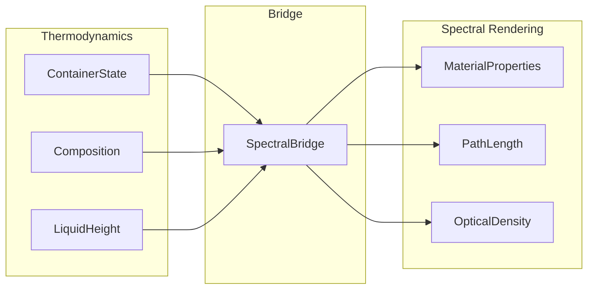

# Spectral Integration

## Overview

This document defines the bridge between the thermodynamics engine and the existing Spectral Rendering system. The goal is to translate thermodynamic state into visual properties.

---

## 1. Existing Spectral System

### 1.1 Current Material Model

The existing spectral rendering system (see `src/core/materials/Material.ts`) uses:

```typescript
// Existing Material interface (reference)
interface MaterialProperties {
  absorptionCoefficients: SpectralData;
  emissionSpectrum?: SpectralData;
  fluorescenceData?: FluorescenceData;
  scatteringCoefficient?: number;
  // ... other optical properties
}
```

### 1.2 What Spectral Rendering Needs

From the thermodynamics system, spectral rendering needs:
- **Path length**: How far light travels through the liquid
- **Concentration**: Of each absorbing species
- **Temperature**: May affect spectra
- **Phase**: Liquid vs gas affects optical properties

---

## 2. Integration Points

### 2.1 Container State → Spectral Properties



### 2.2 Key Mappings

| Thermodynamic Property | Spectral Property |
|------------------------|-------------------|
| Liquid height | Path length (for Beer-Lambert) |
| Mole fractions | Concentration for absorption |
| Temperature | Emission intensity (if relevant) |
| Dissolved gas | Bubble visualization |

---

## 3. Spectral Bridge Interface

### 3.1 Bridge Data Structure

```typescript
interface SpectralBridgeInput {
  /** Container state from thermodynamics */
  readonly containerState: ContainerState;

  /** Viewing angle (affects path length) */
  readonly viewAngle?: number;  // radians from vertical

  /** Light entry point depth */
  readonly entryDepth?: number;  // m from surface

  /** Light exit point depth */
  readonly exitDepth?: number;   // m from surface
}

interface SpectralBridgeOutput {
  /** Effective path length through liquid in meters */
  readonly pathLength: number;

  /** Material properties for each substance */
  readonly materials: Map<SubstanceId, MaterialProperties>;

  /** Combined absorption coefficients (wavelength → coefficient) */
  readonly combinedAbsorption: SpectralData;

  /** Total optical density at reference wavelength */
  readonly opticalDensity: number;

  /** Dominant color (for quick display) */
  readonly dominantColor?: [number, number, number];  // RGB
}
```

### 3.2 Implementation

```typescript
class SpectralBridge {
  private readonly materialRegistry: MaterialRegistry;

  constructor(materialRegistry: MaterialRegistry) {
    this.materialRegistry = materialRegistry;
  }

  /**
   * Convert thermodynamic state to spectral properties.
   */
  convert(input: SpectralBridgeInput): SpectralBridgeOutput {
    const { containerState, viewAngle = 0, entryDepth = 0, exitDepth } = input;

    // Calculate path length
    const actualExitDepth = exitDepth ?? containerState.liquidHeight;
    const verticalPath = actualExitDepth - entryDepth;
    const pathLength = verticalPath / Math.cos(viewAngle);

    // Get materials for each substance
    const materials = new Map<SubstanceId, MaterialProperties>();
    const fractions = getMoleFractions(containerState.composition);

    for (const [id, x] of fractions) {
      const material = this.getMaterialForSubstance(id);
      if (material) {
        materials.set(id, material);
      }
    }

    // Calculate combined absorption
    const combinedAbsorption = this.combineAbsorption(materials, fractions);

    // Calculate optical density at 550nm (reference)
    const od550 = combinedAbsorption.get(550) ?? 0 * pathLength;

    return {
      pathLength,
      materials,
      combinedAbsorption,
      opticalDensity: od550,
    };
  }

  private getMaterialForSubstance(id: SubstanceId): MaterialProperties | undefined {
    // Look up material by substance ID or linked material ID
    return this.materialRegistry.get(id);
  }

  private combineAbsorption(
    materials: Map<SubstanceId, MaterialProperties>,
    fractions: Map<SubstanceId, number>
  ): SpectralData {
    // Beer-Lambert law: A = ε × c × l
    // For mixtures: A_total = Σ A_i = Σ (ε_i × c_i × l)

    const combined = new Map<number, number>();
    const wavelengths = [400, 450, 500, 550, 600, 650, 700];  // Key wavelengths

    for (const wavelength of wavelengths) {
      let totalAbsorption = 0;

      for (const [id, material] of materials) {
        const epsilon = material.absorptionCoefficients.get(wavelength) ?? 0;
        const fraction = fractions.get(id) ?? 0;
        totalAbsorption += epsilon * fraction;
      }

      combined.set(wavelength, totalAbsorption);
    }

    return combined;
  }
}
```

---

## 4. Path Length Calculation

### 4.1 Simple Vertical Path

For light entering from top and exiting at bottom:
```
pathLength = liquidHeight
```

### 4.2 Angled View

For light at angle θ from vertical:
```
pathLength = liquidHeight / cos(θ)
```

### 4.3 Side View (Common for Demos)

For horizontal viewing through a beaker:
```
pathLength = beakerDiameter (at liquid level)
```

```typescript
function calculateSideViewPathLength(
  geometry: ContainerGeometry,
  viewHeight: number  // Height above container bottom
): number {
  // For cylindrical containers
  if (geometry.shape === 'cylinder' || geometry.shape === 'beaker') {
    const radius = Math.sqrt(geometry.crossSection / Math.PI);
    return 2 * radius;  // Diameter
  }

  // For other shapes, approximate
  return Math.sqrt(geometry.crossSection) * 2;
}
```

---

## 5. Concentration Effects

### 5.1 Beer-Lambert Law

**Absorbance** at wavelength λ:
```
A(λ) = ε(λ) × c × l
```

where:
- ε(λ) = molar absorption coefficient (L/(mol·cm))
- c = concentration (mol/L)
- l = path length (cm)

**Transmittance**:
```
T(λ) = 10^(-A(λ))
```

### 5.2 Mixture Absorbance

For a mixture:
```
A_total(λ) = Σ ε_i(λ) × c_i × l
```

Each component contributes independently (Beer-Lambert is linear).

### 5.3 Implementation

```typescript
interface AbsorbanceInput {
  /** Container state */
  readonly containerState: ContainerState;
  /** Path length in cm */
  readonly pathLengthCm: number;
}

interface AbsorbanceResult {
  /** Absorbance at each wavelength */
  readonly absorbance: Map<number, number>;
  /** Transmittance at each wavelength (0-1) */
  readonly transmittance: Map<number, number>;
}

function calculateAbsorbance(
  input: AbsorbanceInput,
  materialRegistry: MaterialRegistry
): AbsorbanceResult {
  const { containerState, pathLengthCm } = input;

  // Calculate concentration of each component
  const totalVolume = containerState.volume.totalVolume;  // L
  const concentrations = new Map<SubstanceId, number>();

  for (const [id, moles] of containerState.composition.moles) {
    concentrations.set(id, moles / totalVolume);  // mol/L
  }

  // Calculate absorbance at each wavelength
  const absorbance = new Map<number, number>();
  const transmittance = new Map<number, number>();

  const wavelengths = [400, 420, 440, 460, 480, 500, 520, 540, 560, 580, 600, 620, 640, 660, 680, 700];

  for (const wavelength of wavelengths) {
    let A = 0;

    for (const [id, c] of concentrations) {
      const material = materialRegistry.get(id);
      if (material?.absorptionCoefficients) {
        const epsilon = material.absorptionCoefficients.get(wavelength) ?? 0;
        A += epsilon * c * pathLengthCm;
      }
    }

    absorbance.set(wavelength, A);
    transmittance.set(wavelength, Math.pow(10, -A));
  }

  return { absorbance, transmittance };
}
```

---

## 6. Temperature Effects

### 6.1 Emission Intensity

Some substances emit light when heated (incandescence). The emission intensity follows the Stefan-Boltzmann law:
```
I ∝ T⁴
```

For the temperature range of this demo (ambient to ~100°C), thermal emission is negligible.

### 6.2 Spectral Shifts

Some absorption spectra shift with temperature. This is a minor effect for most common liquids in the visible range.

### 6.3 Thermochromic Indicators (Future)

Some substances change color with temperature:
- Cobalt chloride: Blue (dry/hot) ↔ Pink (hydrated/cool)
- Liquid crystals: Color changes with temperature

---

## 7. Visual Indicators

### 7.1 Property-to-Visual Mapping

| Property | Visual Representation |
|----------|----------------------|
| Composition | Color (absorption) |
| Fill level | Liquid height in container |
| Bubbles | Dissolved gas escaping |
| Meniscus | Surface tension effect |
| Layers | If stratified (future) |

### 7.2 Meniscus Shape

Surface tension affects meniscus curvature:
```
h_meniscus = (2 × γ × cos(θ)) / (ρ × g × r)
```

For rendering, the meniscus height is proportional to surface tension.

```typescript
function calculateMeniscusVisual(
  surfaceTension: number,
  contactAngle: number,
  tubeRadius: number
): { height: number; curvature: number } {
  const rho = 1000;  // Approximate water density
  const g = 9.81;

  const height = (2 * surfaceTension * Math.cos(contactAngle)) / (rho * g * tubeRadius);
  const curvature = 1 / tubeRadius;  // Simplified

  return { height, curvature };
}
```

---

## 8. Integration API

### 8.1 Container Rendering Data

```typescript
interface ContainerRenderData {
  /** Container geometry for shape */
  readonly geometry: ContainerGeometry;

  /** Fill level (0-1) */
  readonly fillLevel: number;

  /** Liquid height in container units */
  readonly liquidHeight: number;

  /** Dominant color of liquid */
  readonly liquidColor: [number, number, number, number];  // RGBA

  /** Transmittance spectrum for accurate rendering */
  readonly transmittance: Map<number, number>;

  /** Meniscus height for surface rendering */
  readonly meniscusHeight: number;

  /** Whether showing bubbles (supersaturated gas) */
  readonly showBubbles: boolean;
}

function getContainerRenderData(
  container: Container,
  spectralBridge: SpectralBridge
): ContainerRenderData {
  const state = container.state;

  // Get spectral data
  const spectral = spectralBridge.convert({
    containerState: state,
  });

  // Calculate dominant color from transmittance
  const liquidColor = calculateDominantColor(spectral.combinedAbsorption);

  return {
    geometry: container.geometry,
    fillLevel: state.fillFraction,
    liquidHeight: state.liquidHeight,
    liquidColor,
    transmittance: new Map(/* from spectral */),
    meniscusHeight: calculateMeniscusVisual(
      state.surfaceTension,
      0,  // Contact angle for water-glass
      Math.sqrt(container.geometry.crossSection / Math.PI)
    ).height,
    showBubbles: false,  // Would check supersaturation
  };
}
```

---

## 9. Interaction Points

- **[src/core/materials/Material.ts]**: Existing Material system
- **[04_Volume_System.md](04_Volume_System.md)**: Liquid volume/height
- **[12_Surface_Tension.md](12_Surface_Tension.md)**: Meniscus shape
- **[17_Container_Model.md](17_Container_Model.md)**: Container state
- **[19_Demo_Specification.md](19_Demo_Specification.md)**: Visual demo requirements
